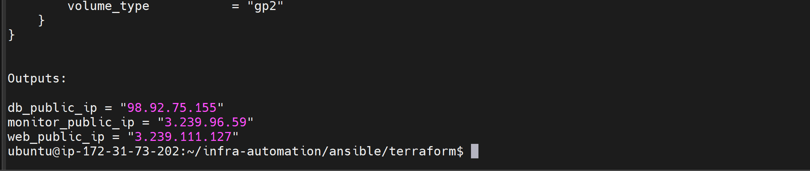
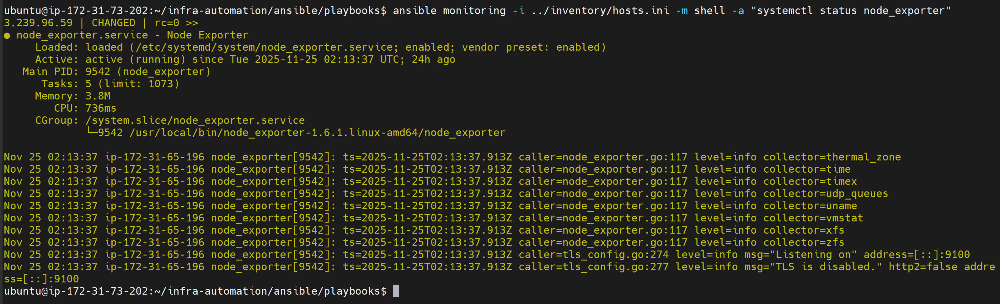
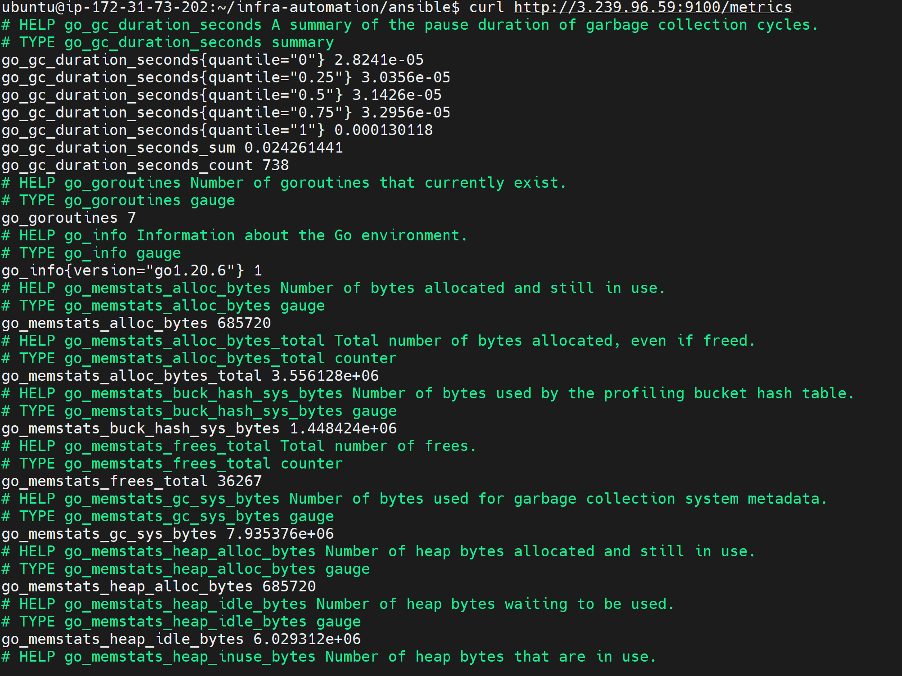
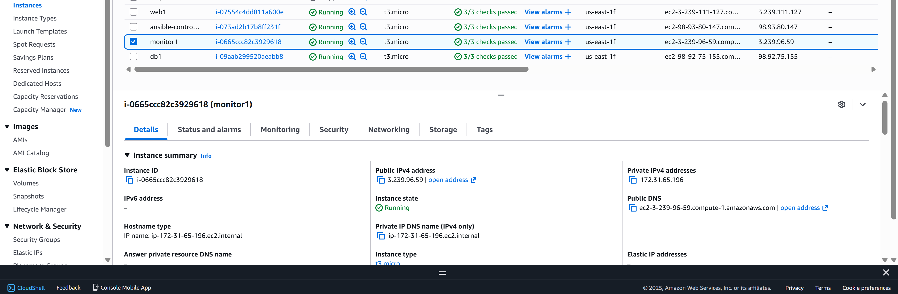

# Infra Automation for Web, DB, and Monitoring Servers

## Overview
This repository automates the provisioning and configuration of web servers, database servers, and a monitoring stack using **Terraform** and **Ansible**.  
The monitoring server runs **Node Exporter** to expose server metrics.

## Tools
- **Terraform** – Infrastructure provisioning on AWS
- **Ansible** – Configuration management and automation
- **Node Exporter** – Linux server metrics
- **Ubuntu Linux** – Target OS
- **AWS EC2** – Cloud instances

## Requirements for this project
- AWS account with credentials configured
- Ansible installed 
- Terraform installed 
- SSH key to connect to EC2 instances

## Setup Instructions

### 1. Clone the repository
git clone https://github.com/cokeryeena/infra-automation.git

- Navigate to Ansible folder:
cd infra-automation/ansible

- Run Terraform to provision: 
terraform init && terraform plan && terraform apply

- Run Ansible playbooks:
ansible-playbook -i inventory/hosts.ini playbooks/site.yml --tags monitoring

- Check Node Exporter service:
ansible monitoring -i inventory/hosts.ini -m shell -a "systemctl status node_exporter"

- Check metrics page:
curl http://3.239.96.59:9100/metrics

- Verify ports
ansible monitoring -i ../inventory/hosts.ini -m shell -a "ss -tulnp | grep 9100"

- AWS Console (Running Servers)

## Notes / Troubleshooting

- Port 9100 blocked – Ensured my  monitoring server security group allows inbound TCP traffic on 9100.

- Missing binaries – Ensured node Exporter binary was present at /usr/local/bin/node_exporter-1.6.1.linux-amd64/node_exporter.

- Playbook fails – Ran ansible-playbook with --diff and -vvv flags for debugging.
